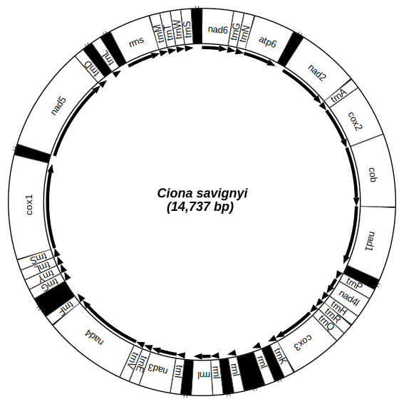
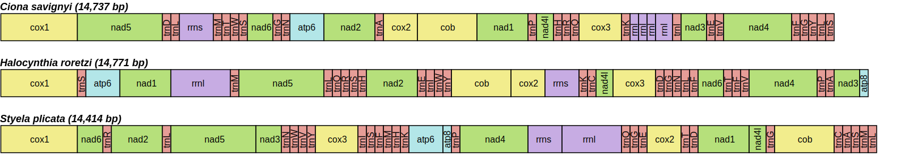
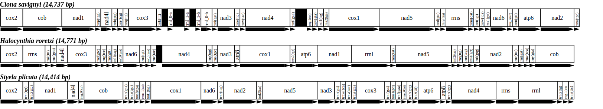

# mtSVG

Convert a mtDNA GFF returned by MITOS2 or converted from GenBank to a simplified SVG representation.

## Installation

Require `Python3`, the script `mtSVG.py` and the library `drawsvg` which can be installed as follows: 

```
python3 -m pip install "drawsvg~=2.0"
```

Or if you prefer to work in a conda environement, for instance `mtSVG`, you can install it with:

```
conda create -n mtSVG pip -y
conda activate mtSVG
python3 -m pip install "drawsvg~=2.0"
git clone https://github.com/odethier-ulb/mtSVG.git
cp mtSVG/mtSVG.py $CONDA_PREFIX/bin
chmod a+x $CONDA_PREFIX/bin/mtSVG.py
rm -rf mtSVG
```

## Usage

Example:
```
usage: mtSVG.py [-h] [--gff GFF] [--species SPECIES] [--size SIZE]
                [--reversed] [--gffs GFFS] [--start START | --linear]
                [--intergenic INTERGENIC] [--oriented] [--full_name]
                [--monochromatic] [--font FONT] [--output OUTPUT]

Convert a mtDNA GFF to a linear SVG representation

optional arguments:
  -h, --help            show this help message and exit
  --gff GFF             The path of a single gff file
  --species SPECIES     The species name (ignored if --gffs is used)
  --size SIZE           The size of the mtDNA in base pair (ignored if --gffs
                        is used)
  --reversed            Reverse the gene order (ignored if --gffs is used)
  --gffs GFFS           The path of the semicolon separated config file to
                        draw multiple ribbons. Each entry in the config file
                        must have the following format: "species;mtdna
                        size;gff path;reverse gene order" like for instance
                        "Halocynthia
                        roretzi;14771;example/h_roretzi.gff;false". Comments
                        can be inserted using "#" to start a line and the last
                        "true/false" value for the gene order can be omitted
                        when using false
  --start START         Start gene of the ribbon
  --linear              Show the genes in the same order as in the gff file.
  --intergenic INTERGENIC
                        Display intergenic regions having a size = or >,
                        skipped if 0 is set
  --oriented            Display gene orientations
  --full_name           Display gene full names
  --monochromatic       Do not colorize
  --font FONT           The font to use
  --output OUTPUT       The path of the output to create
  --circular            Draw a circular representation (for --gff only)
  --skip                Comma-separated list of gene name prefixes (without space) to skip.
                        For instance "--skip trn,at" will not draw tRNA and ATP synthase genes.
```

## Usages

#### 1. Generate a single mtDNA ribbon with the default parameters

```
./mtSVG.py --gff example/s_plicata.gff --species "Styela plicata" --size 14414
```


#### 2. Generate a single circular mtDNA with custom parameters

For instance, if we want to draw a circular representation using `nad6` as start gene, display intergenic regions having a size ≥ 50 bp as black blocs, draw gene orientations and do not colorize.

```
./mtSVG.py --gff example/c_savignyi.gff --species "Ciona savignyi" --size 14737 --circular --oriented --monochromatic --intergenic 50 --start nad6
```



#### 3. Generate multiple mtDNA ribbons with the default parameters

```
./mtSVG.py --gffs example/config.csv
```



#### 4. Generate multiple mtDNA ribbons with custom parameters

For instance, if we want to use `cox2` as start gene, `Times New Roman` as the font, 
display intergenic regions having a size ≥ 100 bp, display the gene orientation, use the full gene names,
do not colorize and output the results in a file named `multiple_gffs_custom.svg`.

```
./mtSVG.py --gffs example/config.csv --start cox2 --font "Times New Roman" --intergenic 100 --oriented --full_name --monochromatic --output multiple_gffs_custom.svg
```


